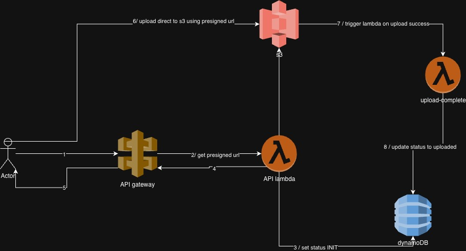
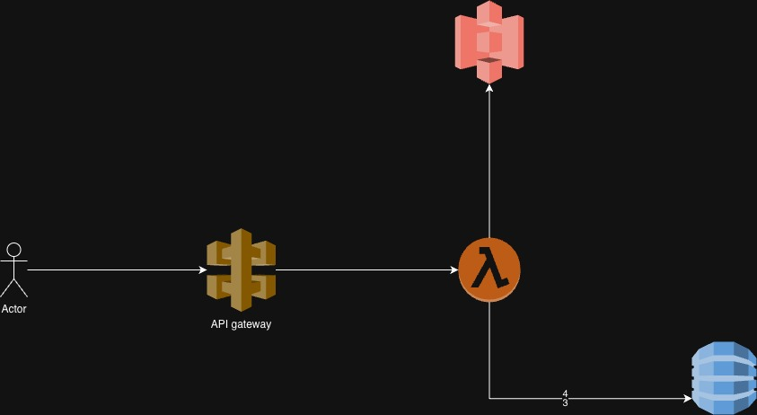

# image-service-localstack

git clone <your-repo>
cd image-upload-service
docker-compose up

## Swagger UI

Swagger UI is available at:

http://localhost:8080

Note:
- Replace `{apiId}` in the server URL with the actual API ID printed in LocalStack logs(docker-compose logs -f localstack).
- Example base URL:
  http://localhost:4566/restapis/apiid/dev/_user_request_

## UPLOAD FLOW

---

## Architecture Overview

